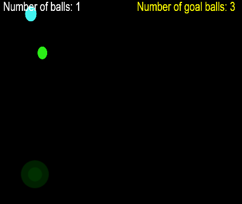
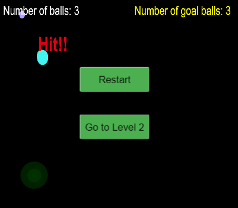
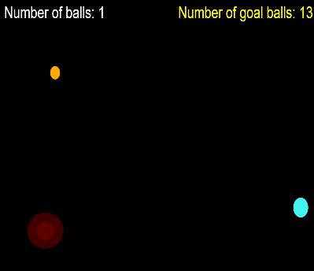
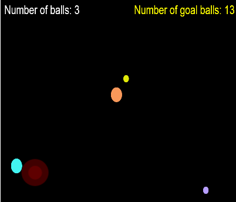
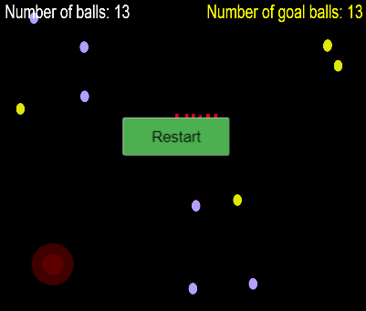

# web_develop

[點此試玩](https://agile-coast-26844.herokuapp.com/)

## 遊戲說明
本遊戲主要是透過JavaScript來撰寫，利用Canvas來表現出球及背景。

本遊戲的玩法是藉由螢幕中的搖桿來移動主角球，透過與水藍色的母球接觸，可以使主角球隨機變換顏色，
並透過亂數的方式，機率在螢幕中生成2種顏色的球，分別是紫球與黃球，透過產生足夠的球來過關。
> - 紫球的特性為，與主角球碰觸時，會機率生出球，並且不會消失。
> - 黃球的特性為，與主角球碰觸時，會機率生出球，並且消失。

---------------------------------------
## 遊戲畫面

*   第一關(開始畫面) 
 

*   第一關(結束畫面) 
 

*   第二關(開始畫面) 
 

*   第二關(進行中畫面) 
 

*   第二關(結束畫面) 
 

---------------------------------------
##程式碼介紹

搖桿參照[nipplejs](https://github.com/yoannmoinet/nipplejs)的作法。

Javascript中取得畫布(Canvas)的物件:

<pre><code>
var canvas = document.getElementById("myCanvas");
var ctx = canvas.getContext("2d");
</code></pre>

藉由宣告small_ball的類別，並透過prototype的方式定義出small_ball中的draw方法:

<pre><code>
  function small_ball(x1, y1, size, color, dx1, dy1) {
  		this.x1=x1;
  		this.y1=y1;
  		this.size=size;
  		this.color=color;
  		this.dx1 = dx1;
  		this.dy1 = dy1;
          }
         small_ball.prototype.draw = function() {
             ctx.beginPath();
             ctx.arc(this.x1, this.y1, this.size, 0, Math.PI*2);
             ctx.fillStyle = this.color;
             ctx.fill();
             ctx.closePath();
         }
</code></pre>

透過new產生small_ball_01物件:

<pre><code>
var small_ball_01 = new small_ball(300,300,30,"#42f4f1",1,-1);
</code></pre>

